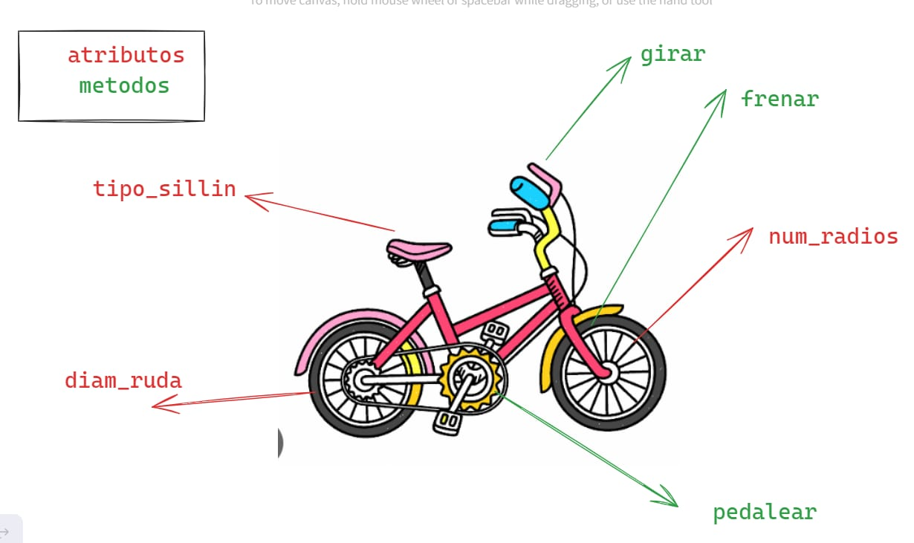
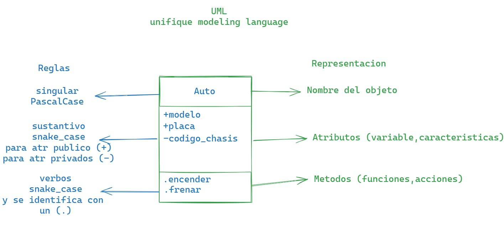

# 🚌POO - Programación Orientada a Objetos
La programación orientada a objetos - `POO` o en sus siglas en inglés `OOP`, es una manera de programar (paradigma*), permite llevar al código mecanismos usados con `entidades` de la vida real.
**sus beneficios son los siguientes:**
1. Eencapsulamiento: permite `empaquetar` el codigo dentro de una
unidad (objeto) donde se puede determinar el ambito de actuacion.
2. Abstraccion: permite `generalizar` los tipos de objetos atravez de las clases y simplificar el programa.
3. Herencia: permite `reutilizar` codigo al poder heredar atributos y comportamientos de una clase.
4. Polimorfismo:permite `crear` multiples objetos a partir de una misma pieza flexible de codigo.
existe 2 pilar mas que a este nivel que estan mis alumnitos van a pujar.

existen dos que a nivel educativo no es nesesario aprenderlo.
5. Acoplamiento
6. Cohesion

## que es un objeto
un `objeto` es un tipo de dato estructurado que contiene o almacena `datos` y `codigo`.

|Elementos |que son | como se llama|como se identifica  |
|----------|--------|--------------|--------------------|
|Dato      |variable|Atributos     |Mediante sustantivos|
|Codigo    |Funcion |Metodo        |Mediante verbos     |

un objeto representa un `instancia unica` de alguna `entidad` a travez de sus atributos e interctua con otros objetos o con si  mismo atravez de sus metodos.

## que es una clase 
para crear un `objeto` primero debemos definir la `clase`.
para responder la pregunta de alex, debemos pensar en la `clase` como el `molde` con el que se crean  nuevo objetos.
En el proceso de diseño de una clase hay que tener en cuenta `el principio de responsabilidad unica`, esto intentando que los `atributos` y los `metodos` esten enfocados en un objetivo unico y bien definido.

> [!TIP]
> *Un paradigma de programación en un método, técnica o estilo de programar. Muchos de los lenguajes de programación son creados en base a un paradigma, ejemplo `java` es un lenguaje que adopta el paradigma `POO`(Programación Orientada a Objeto). Sin embargo existen lenguajes de programación que adoptan varios paradigmas como es el caso de python y javascript, estos son lenguajes multiparadigmas.

